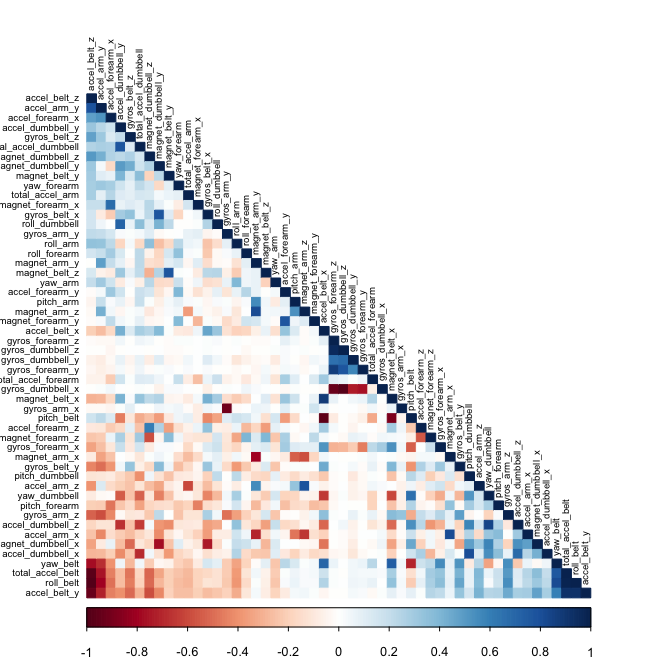
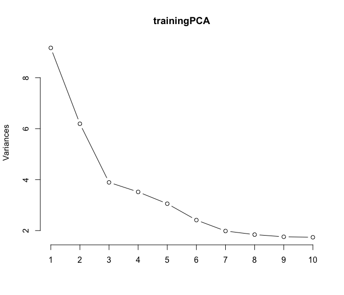
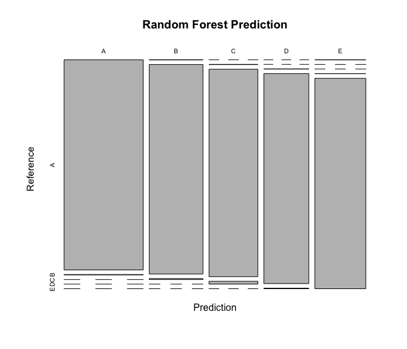

# Practical Machine Learning Course Project
Brett Addison  
July 2, 2017  

##**Executive Summary**
In this project, I quantify how well 6 participants perform barbell lifts. To accomplish this task, I use data collected from accelerometers located on the belt, forearm, arm, and dumbell to train a few different machine learning prediction models. I then evaluated the accuracy of the models. I found that the random forest model had the highest accuracy, >99%. I then used this model to predict on 20 different test cases. My model was successful in predicting all 20 cases.

##**Background**
Currently there exist many devices on the market, such as Fitbit, Gear Fit, Apple Watch Nike+, etc., that tract personal activities. A significant number of health enthusiats and tech geeks alike regularly take measurements during workout routines to track their fitness and to improve their health. People are generally good at quantifying how much of a particular activity they do, but they rarely quantify how well they do it. The goal of this project is to use data obtained from accelerometers on the belt, forearm, arm, and dumbell of 6 participants to predict how well they performed barbell lifts. These participants were asked to perform barbell lifts correctly and incorrectly in 5 different ways. More information is available from the website here: <http://groupware.les.inf.puc-rio.br/har> (see the section on the Weight Lifting Exercise Dataset).

A short discription of the data set as described on the above mentioned website is as follows:

"Six young health participants were asked to perform one set of 10 repetitions of the Unilateral Dumbbell Biceps Curl in five different fashions: exactly according to the specification (Class A), throwing the elbows to the front (Class B), lifting the dumbbell only halfway (Class C), lowering the dumbbell only halfway (Class D) and throwing the hips to the front (Class E).

Class A corresponds to the specified execution of the exercise, while the other 4 classes correspond to common mistakes. Participants were supervised by an experienced weight lifter to make sure the execution complied to the manner they were supposed to simulate. The exercises were performed by six male participants aged between 20-28 years, with little weight lifting experience. We made sure that all participants could easily simulate the mistakes in a safe and controlled manner by using a relatively light dumbbell (1.25kg)."

Read more: http://groupware.les.inf.puc-rio.br/har#ixzz4ldfRAOXH

The training data for this project are available here:
<https://d396qusza40orc.cloudfront.net/predmachlearn/pml-training.csv>

The test data are available here:
<https://d396qusza40orc.cloudfront.net/predmachlearn/pml-testing.csv>

The data for this project come from this source: <http://groupware.les.inf.puc-rio.br/har>. I would like to thank the authors of this study, Velloso et al. (2013), for their generousity in allowing their data to be used in my assignment.

##**Exploratory Data Analysis**
###Setting Up the Environment
First I loaded the required packages to perform the data analysis.

```r
library(ggplot2)
library(plyr)
library(knitr)
library(caret)
library(lubridate)
library(parallel)
library(doParallel)
library(rattle)
library(gbm)
library(e1071)
library(rpart)
library(rpart.plot)
library(corrplot)
```

Next I downloaded and read into R the training and test data sets.

```r
urlTraining <- 'https://d396qusza40orc.cloudfront.net/predmachlearn/pml-training.csv'
urlTesting <- 'https://d396qusza40orc.cloudfront.net/predmachlearn/pml-testing.csv'

#Read in the training and testing datasets into R. Convert blank "" values into NA values.
training_data <- read.csv(url(urlTraining), na.strings=c("", "NA"))
testing_data <- read.csv(url(urlTesting), na.strings=c("", "NA"))
```

###Data Partitioning
Here I partition the training data into a training set and a validation set, (70% training and 30% validation). 

```r
set.seed(1000)

inBuild <- createDataPartition(y=training_data$classe, p=0.7, list=FALSE)

validation <- training_data[-inBuild,]
training <- training_data[inBuild,]
training2 <- training_data       #Full training data set to build most accurate final prediction model on.
```

###Cleaning Data
These data sets consist of a large number of variables, 160 to be exact. A significant number of the variables contain lots of NA's and blank data. These variables should be removed from the data sets otherwise model fitting will be difficult or next to impossible. When I read in the data, I specified that blank data "" should be converted to NA. Additionally, the first five columns are identification and user name only variables. I will remove these columns first, then I will remove all the columns that contain NA data.

```r
training <- training[,-(1:5)]
training2 <- training2[,-(1:5)]
validation <- validation[,-(1:5)]
testing_data <- testing_data[,-(1:5)]

#Find columns with NA values in training set and remove those same columns in the validation
#and testing data.
any_NA_columns <- apply(training, 2, function(x)any(is.na(x)))
col_nums_missing <- which(any_NA_columns==TRUE)

trainingCleaned <- training[,-col_nums_missing]
trainingCleaned2 <- training2[,-col_nums_missing]
validationCleaned <- validation[,-col_nums_missing]
testingCleaned <- testing_data[,-col_nums_missing]

#Remove new_window and num_window columns, the first two columns.
trainingCleaned <- trainingCleaned[, -(1:2)]
trainingCleaned2 <- trainingCleaned2[, -(1:2)]
validationCleaned <- validationCleaned[,-(1:2)]
testingCleaned <- testingCleaned[,-(1:2)]
```

There are now 53 variables in each data set.

```r
dim(trainingCleaned)
```

```
## [1] 13737    53
```

Finally, the classe variable (the one that indicates how well the routine was performed) needs to be converted to a factor variable since it is not a continuous variable.

```r
trainingCleaned$classe <- as.factor(trainingCleaned$classe)
trainingCleaned2$classe <- as.factor(trainingCleaned2$classe)
validationCleaned$classe <- as.factor(validationCleaned$classe)

# set up training run for x / y syntax because model format performs poorly when running model in parallel.
x <- trainingCleaned[,-53]
y <- trainingCleaned[,53]

x2 <- trainingCleaned2[,-53]
y2 <- trainingCleaned2[,53]
```

###Correlation and Principle Component Analysis
Due to the shear number of variables in this data set, it is worth determining if any of the variables are not needed as a predictor for the models.

```r
corMatrix <- cor(trainingCleaned[, -53])
```


```r
corrplot(corMatrix, method="color", type="lower", order = "FPC", tl.cex = 0.6, tl.col = "black")
```

<div class="figure" style="text-align: center">

<p class="caption">Fig. 1: Correlations between variables for the training data set. Red indicates variables that are highly correlated with each other while blue indicates variables that are negatively correlated.</p>
</div>

Here I perform principle component analysis and plot the results below.

```r
trainingCleanedLog <- log(abs(trainingCleaned[, 1:dim(trainingCleaned)[2]-1])+1)
classeVar <- trainingCleaned[, dim(trainingCleaned)[2]]
trainingPCA <- prcomp(trainingCleanedLog, center=TRUE, scale.=TRUE)
summary(trainingPCA)
```

```
## Importance of components%s:
##                           PC1    PC2     PC3     PC4     PC5    PC6
## Standard deviation     3.0283 2.4885 1.97286 1.87555 1.74768 1.5533
## Proportion of Variance 0.1764 0.1191 0.07485 0.06765 0.05874 0.0464
## Cumulative Proportion  0.1764 0.2954 0.37030 0.43795 0.49669 0.5431
##                            PC7     PC8     PC9    PC10    PC11    PC12
## Standard deviation     1.40847 1.35723 1.32516 1.31808 1.17061 1.11265
## Proportion of Variance 0.03815 0.03542 0.03377 0.03341 0.02635 0.02381
## Cumulative Proportion  0.58124 0.61666 0.65043 0.68384 0.71020 0.73400
##                           PC13    PC14    PC15    PC16    PC17    PC18
## Standard deviation     1.03788 0.97988 0.95342 0.93031 0.89530 0.83041
## Proportion of Variance 0.02072 0.01846 0.01748 0.01664 0.01541 0.01326
## Cumulative Proportion  0.75472 0.77318 0.79067 0.80731 0.82272 0.83598
##                           PC19    PC20    PC21    PC22    PC23    PC24
## Standard deviation     0.79760 0.77538 0.75330 0.72695 0.70771 0.68357
## Proportion of Variance 0.01223 0.01156 0.01091 0.01016 0.00963 0.00899
## Cumulative Proportion  0.84822 0.85978 0.87069 0.88086 0.89049 0.89947
##                           PC25    PC26    PC27    PC28    PC29   PC30
## Standard deviation     0.67549 0.63518 0.61552 0.58945 0.58009 0.5633
## Proportion of Variance 0.00877 0.00776 0.00729 0.00668 0.00647 0.0061
## Cumulative Proportion  0.90825 0.91601 0.92329 0.92997 0.93645 0.9425
##                           PC31   PC32    PC33    PC34    PC35    PC36
## Standard deviation     0.55617 0.5347 0.51675 0.48798 0.47105 0.45926
## Proportion of Variance 0.00595 0.0055 0.00514 0.00458 0.00427 0.00406
## Cumulative Proportion  0.94850 0.9540 0.95913 0.96371 0.96798 0.97203
##                           PC37    PC38    PC39    PC40    PC41    PC42
## Standard deviation     0.43441 0.42942 0.41166 0.39726 0.37905 0.36100
## Proportion of Variance 0.00363 0.00355 0.00326 0.00303 0.00276 0.00251
## Cumulative Proportion  0.97566 0.97921 0.98247 0.98550 0.98827 0.99077
##                          PC43    PC44    PC45    PC46    PC47    PC48
## Standard deviation     0.3307 0.31732 0.30454 0.25943 0.22975 0.16253
## Proportion of Variance 0.0021 0.00194 0.00178 0.00129 0.00102 0.00051
## Cumulative Proportion  0.9929 0.99481 0.99660 0.99789 0.99890 0.99941
##                           PC49    PC50    PC51    PC52
## Standard deviation     0.10679 0.09079 0.07995 0.06705
## Proportion of Variance 0.00022 0.00016 0.00012 0.00009
## Cumulative Proportion  0.99963 0.99979 0.99991 1.00000
```


```r
plot(trainingPCA, type='l')
```

<div class="figure" style="text-align: center">

<p class="caption">Fig. 2: A plot showing the amount of variability in the data from the top ten principle components.</p>
</div>

As shown in Figure 2, the first two principle components contribute to the majority of the variability in the data. However, it appears there are a significant number of variables that contribute almost equally to the variability thus I will not eliminate any variables in the analysis.

##**Building Predictive Models**
In this section, I will build four predictive models using the training data set and test them with the validation data set. I then chose the best model, fit it with the complete training data set to build the most accurate model, and apply it to predict on the test data for the classe variable.

###Random Forest Model


```r
#Create a trainControl function with a 10 fold cross validation.
fitControl <- trainControl(method = "cv", number = 10, allowParallel = TRUE)
#Fit model to training data.
modFitRF <- train(x, y, data=trainingCleaned, method="rf", trControl=fitControl)
```


```r
#Print the model accuracy.
print(confusionMatrix.train(modFitRF))
```

```
## Cross-Validated (10 fold) Confusion Matrix 
## 
## (entries are percentual average cell counts across resamples)
##  
##           Reference
## Prediction    A    B    C    D    E
##          A 28.4  0.2  0.0  0.0  0.0
##          B  0.0 19.1  0.1  0.0  0.0
##          C  0.0  0.1 17.3  0.2  0.0
##          D  0.0  0.0  0.1 16.2  0.1
##          E  0.0  0.0  0.0  0.0 18.3
##                             
##  Accuracy (average) : 0.9922
```


```r
#Now predict on the validation data set.
predRF <- predict(modFitRF, newdata = validationCleaned)
print(confusionMatrix(predRF, validationCleaned$classe))
```

```
## Confusion Matrix and Statistics
## 
##           Reference
## Prediction    A    B    C    D    E
##          A 1672    8    0    0    0
##          B    2 1130    5    0    1
##          C    0    1 1019   11    0
##          D    0    0    2  952    7
##          E    0    0    0    1 1074
## 
## Overall Statistics
##                                           
##                Accuracy : 0.9935          
##                  95% CI : (0.9911, 0.9954)
##     No Information Rate : 0.2845          
##     P-Value [Acc > NIR] : < 2.2e-16       
##                                           
##                   Kappa : 0.9918          
##  Mcnemar's Test P-Value : NA              
## 
## Statistics by Class:
## 
##                      Class: A Class: B Class: C Class: D Class: E
## Sensitivity            0.9988   0.9921   0.9932   0.9876   0.9926
## Specificity            0.9981   0.9983   0.9975   0.9982   0.9998
## Pos Pred Value         0.9952   0.9930   0.9884   0.9906   0.9991
## Neg Pred Value         0.9995   0.9981   0.9986   0.9976   0.9983
## Prevalence             0.2845   0.1935   0.1743   0.1638   0.1839
## Detection Rate         0.2841   0.1920   0.1732   0.1618   0.1825
## Detection Prevalence   0.2855   0.1934   0.1752   0.1633   0.1827
## Balanced Accuracy      0.9985   0.9952   0.9954   0.9929   0.9962
```

###Linear Discriminant Model


```r
#Create a trainControl function with a 10 fold cross validation.
fitControl <- trainControl(method = "cv", number = 10, allowParallel = TRUE)
#Fit model to training data.
modFitLDA <- train(x, y, data=trainingCleaned, method="lda", trControl=fitControl)
```


```r
#Print the model accuracy.
print(confusionMatrix.train(modFitLDA))
```

```
## Cross-Validated (10 fold) Confusion Matrix 
## 
## (entries are percentual average cell counts across resamples)
##  
##           Reference
## Prediction    A    B    C    D    E
##          A 23.3  3.1  1.8  1.0  0.7
##          B  0.6 12.1  1.8  0.7  3.2
##          C  2.3  2.4 11.3  1.9  1.7
##          D  2.1  0.7  2.1 12.1  1.7
##          E  0.1  1.0  0.4  0.7 11.1
##                             
##  Accuracy (average) : 0.7004
```


```r
#Now predict on the validation data set.
predLDA <- predict(modFitLDA, newdata = validationCleaned)
print(confusionMatrix(predLDA, validationCleaned$classe))
```

```
## Confusion Matrix and Statistics
## 
##           Reference
## Prediction    A    B    C    D    E
##          A 1379  163   97   49   39
##          B   32  736   92   40  180
##          C  123  146  690  126   93
##          D  132   44  119  713  111
##          E    8   50   28   36  659
## 
## Overall Statistics
##                                          
##                Accuracy : 0.7098         
##                  95% CI : (0.698, 0.7213)
##     No Information Rate : 0.2845         
##     P-Value [Acc > NIR] : < 2.2e-16      
##                                          
##                   Kappa : 0.6329         
##  Mcnemar's Test P-Value : < 2.2e-16      
## 
## Statistics by Class:
## 
##                      Class: A Class: B Class: C Class: D Class: E
## Sensitivity            0.8238   0.6462   0.6725   0.7396   0.6091
## Specificity            0.9174   0.9275   0.8996   0.9175   0.9746
## Pos Pred Value         0.7985   0.6815   0.5857   0.6372   0.8438
## Neg Pred Value         0.9291   0.9161   0.9286   0.9473   0.9171
## Prevalence             0.2845   0.1935   0.1743   0.1638   0.1839
## Detection Rate         0.2343   0.1251   0.1172   0.1212   0.1120
## Detection Prevalence   0.2935   0.1835   0.2002   0.1901   0.1327
## Balanced Accuracy      0.8706   0.7868   0.7860   0.8286   0.7918
```

###Decision Trees Model

```r
#Fit model to training data.
modFitRPART <- rpart(classe ~ ., data=trainingCleaned, method="class")
```


```r
#Now predict on the validation data set.
predRPART <- predict(modFitRPART, newdata = validationCleaned, type="class")
print(confusionMatrix(predRPART, validationCleaned$classe))
```

```
## Confusion Matrix and Statistics
## 
##           Reference
## Prediction    A    B    C    D    E
##          A 1461  150   10   57   50
##          B   88  814  138   68   71
##          C   14  111  790  161   83
##          D   44   56   47  643   82
##          E   67    8   41   35  796
## 
## Overall Statistics
##                                           
##                Accuracy : 0.7653          
##                  95% CI : (0.7543, 0.7761)
##     No Information Rate : 0.2845          
##     P-Value [Acc > NIR] : < 2.2e-16       
##                                           
##                   Kappa : 0.7028          
##  Mcnemar's Test P-Value : < 2.2e-16       
## 
## Statistics by Class:
## 
##                      Class: A Class: B Class: C Class: D Class: E
## Sensitivity            0.8728   0.7147   0.7700   0.6670   0.7357
## Specificity            0.9366   0.9231   0.9241   0.9535   0.9686
## Pos Pred Value         0.8455   0.6904   0.6816   0.7374   0.8405
## Neg Pred Value         0.9488   0.9309   0.9501   0.9360   0.9421
## Prevalence             0.2845   0.1935   0.1743   0.1638   0.1839
## Detection Rate         0.2483   0.1383   0.1342   0.1093   0.1353
## Detection Prevalence   0.2936   0.2003   0.1969   0.1482   0.1609
## Balanced Accuracy      0.9047   0.8189   0.8470   0.8102   0.8521
```

###Generalized Boosted Model


```r
#Create a trainControl function with a 10 fold cross validation.
fitControl <- trainControl(method = "repeatedcv", number = 10, allowParallel = TRUE)
#Fit model to training data.
modFitGBM <- train(classe ~ ., data=trainingCleaned, method="gbm", verbose=FALSE, trControl = fitControl)
```


```r
#Print the model accuracy.
print(confusionMatrix.train(modFitGBM))
```

```
## Cross-Validated (10 fold, repeated 1 times) Confusion Matrix 
## 
## (entries are percentual average cell counts across resamples)
##  
##           Reference
## Prediction    A    B    C    D    E
##          A 28.0  0.6  0.0  0.0  0.1
##          B  0.3 18.1  0.5  0.0  0.2
##          C  0.1  0.6 16.7  0.5  0.1
##          D  0.0  0.0  0.2 15.7  0.3
##          E  0.0  0.0  0.0  0.1 17.8
##                             
##  Accuracy (average) : 0.9631
```


```r
#Now predict on the validation data set.
predGBM <- predict(modFitGBM, newdata = validationCleaned)
print(confusionMatrix(predGBM, validationCleaned$classe))
```

```
## Confusion Matrix and Statistics
## 
##           Reference
## Prediction    A    B    C    D    E
##          A 1647   32    0    1    0
##          B   22 1079   30    3   10
##          C    4   23  985   43   11
##          D    1    3    8  909   15
##          E    0    2    3    8 1046
## 
## Overall Statistics
##                                           
##                Accuracy : 0.9628          
##                  95% CI : (0.9576, 0.9675)
##     No Information Rate : 0.2845          
##     P-Value [Acc > NIR] : < 2.2e-16       
##                                           
##                   Kappa : 0.9529          
##  Mcnemar's Test P-Value : NA              
## 
## Statistics by Class:
## 
##                      Class: A Class: B Class: C Class: D Class: E
## Sensitivity            0.9839   0.9473   0.9600   0.9429   0.9667
## Specificity            0.9922   0.9863   0.9833   0.9945   0.9973
## Pos Pred Value         0.9804   0.9432   0.9240   0.9712   0.9877
## Neg Pred Value         0.9936   0.9873   0.9915   0.9889   0.9925
## Prevalence             0.2845   0.1935   0.1743   0.1638   0.1839
## Detection Rate         0.2799   0.1833   0.1674   0.1545   0.1777
## Detection Prevalence   0.2855   0.1944   0.1811   0.1590   0.1799
## Balanced Accuracy      0.9880   0.9668   0.9717   0.9687   0.9820
```

##**Selecting Best Model & Predicting on Test Data Set**
###Selecting Best Model & Applying it to Full Test Data
The most accurate model is the random forest model. The accuracy of the four models used in this analysis are the following.
Random Forest:

```
##  Accuracy 
## 0.9935429
```
Linear Discriminant:

```
##  Accuracy 
## 0.7097706
```
Decision Trees:

```
##  Accuracy 
## 0.7653356
```
Generalized Boosted Model:

```
##  Accuracy 
## 0.9627867
```

Now I will apply the random forest model to the full training data set to build the most accurate model.


```r
#Create a trainControl function with a 10 fold cross validation.
fitControl <- trainControl(method = "cv", number = 10, allowParallel = TRUE)
#Fit model to training data.
modFitRF <- train(x2, y2, data=trainingCleaned2, method="rf", trControl=fitControl)
```


```
## Cross-Validated (10 fold) Confusion Matrix 
## 
## (entries are percentual average cell counts across resamples)
##  
##           Reference
## Prediction    A    B    C    D    E
##          A 28.4  0.1  0.0  0.0  0.0
##          B  0.0 19.3  0.1  0.0  0.0
##          C  0.0  0.0 17.3  0.2  0.0
##          D  0.0  0.0  0.0 16.1  0.0
##          E  0.0  0.0  0.0  0.0 18.3
##                             
##  Accuracy (average) : 0.9952
```


```r
plot(confusionMatrix(modFitRF)$table, col = confusionMatrix(modFitRF)$byclass, main = "Random Forest Prediction")
```

<div class="figure" style="text-align: center">

<p class="caption">Fig. 3: A plot showing the prediction across the five classes.</p>
</div>

###Predict on Test Data with Random Forest Model
Here I predict on the test data for the 20 test cases and report the results.

```r
#Print the model accuracy.
predict(modFitRF, testingCleaned[, (1:52)])
```

```
##  [1] B A B A A E D B A A B C B A E E A B B B
## Levels: A B C D E
```

```r
# predict on test set
prediction <- predict(modFitRF, testingCleaned[, (1:52)])

# convert predictions to character vector
prediction <- as.character(prediction)

# create function to write predictions to files
pml_write_files <- function(x) {
    n <- length(x)
    path <- "answers"
    for(i in 1:n) {
        filename <- paste0("problem_id_", i, ".txt")
        write.table(x[i], file=file.path(path, filename), quote=F, row.names=F, col.names=F)
    }
}

# create prediction files to submit
pml_write_files(prediction)
```

##**Summary**
In this project, I successfully quantify how well 6 participants perform barbell lifts from 20 test cases. I used a random forest to train my model on the training data provided by Velloso et al. (2013) and tested it on test data. The most accurate model has an accuracy of >99%.

##**References**
Velloso, E.; Bulling, A.; Gellersen, H.; Ugulino, W.; Fuks, H. **“Qualitative Activity Recognition of Weight Lifting Exercises. Proceedings of 4th International Conference in Cooperation with SIGCHI (Augmented Human ’13)”**. Stuttgart, Germany: ACM SIGCHI, 2013.
